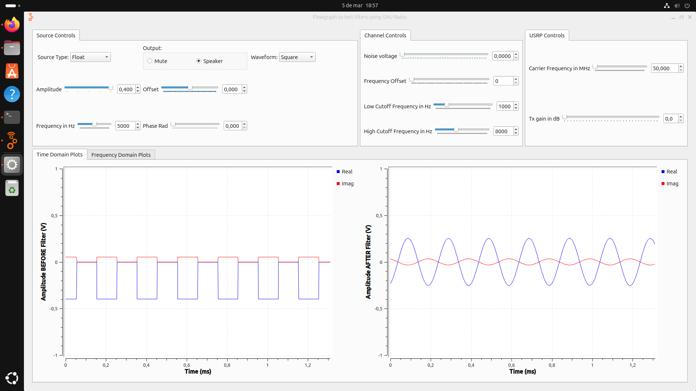
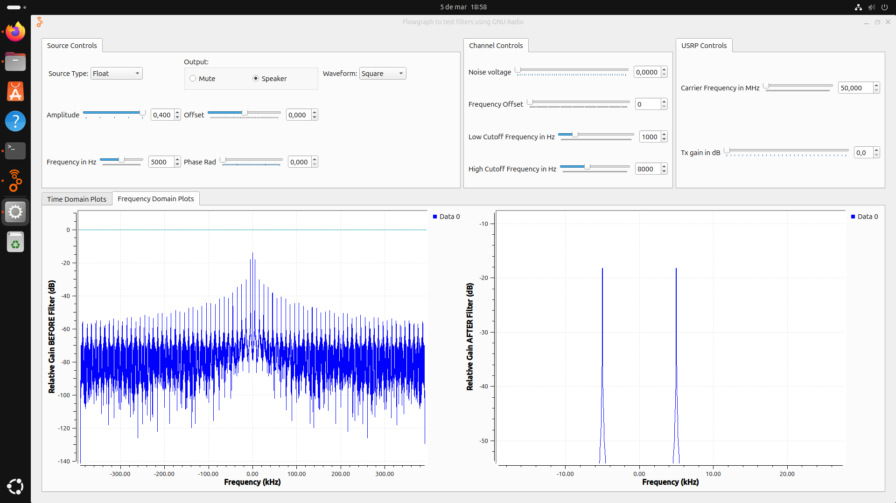
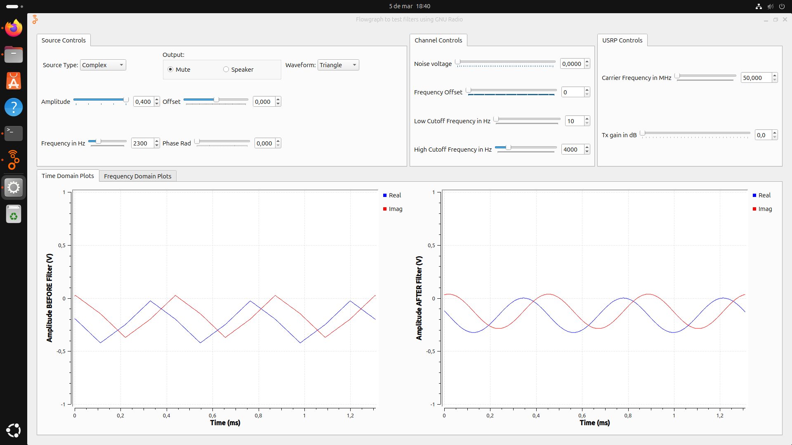
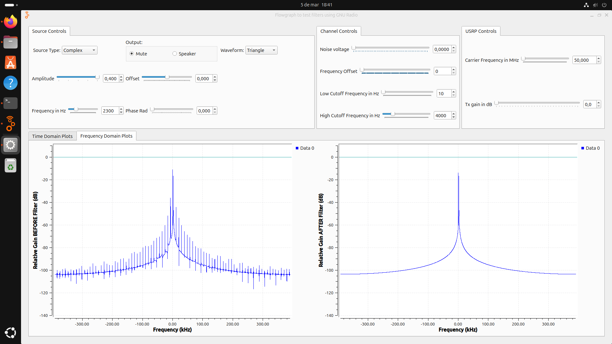
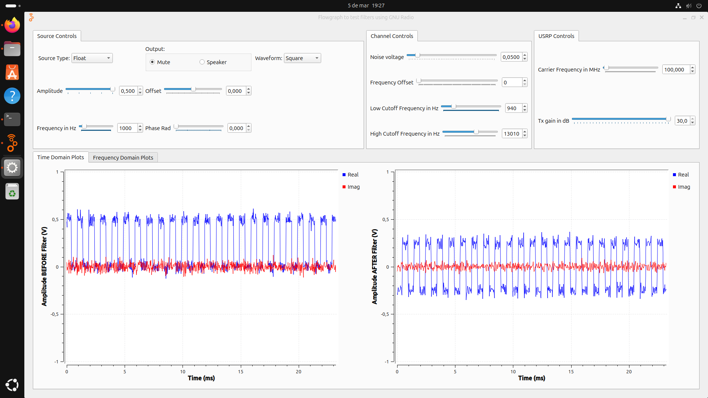
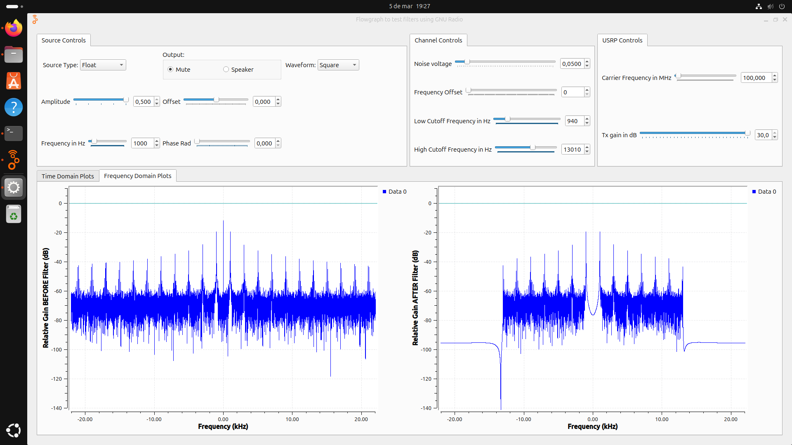
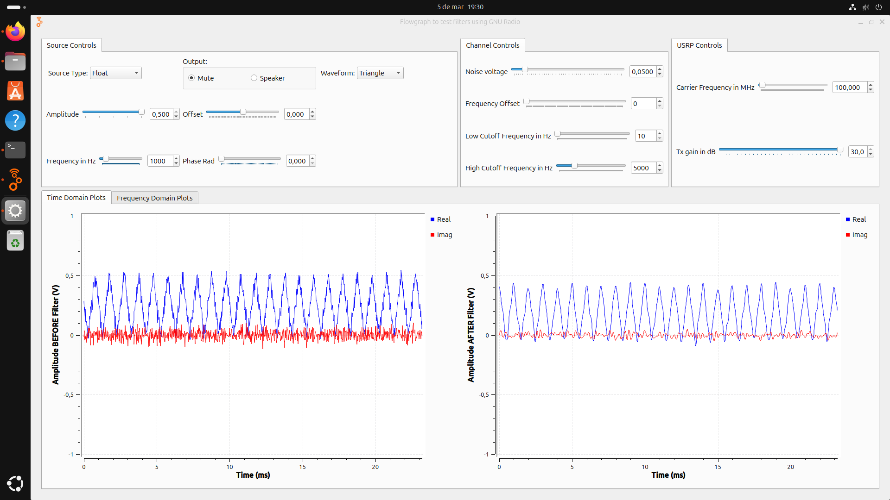
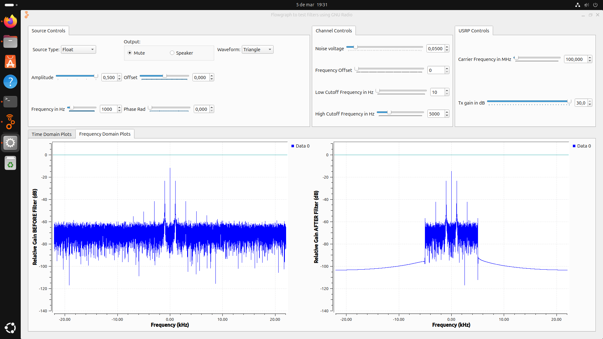

# Laboratorio de Comunicaciones
## Universidad Industrial de Santander

- En caso de utilizar herramientas de Inteligencia Artificial para asistencia en la redacción, análisis o cualquier otra tarea, de debe especificar en la sección de **Declaración de Originalidad y Responsabilidad** aclarando el alcance y propósito de su uso.
- Cualquier omisión en la declaración del uso de IA o la presentación de contenido plagiado será penalizado con nota de 0.0 y reporte a la coordinación del programa.
- Si emplea referencias disponibles en línea, agregue los hipervínculos respectivos.  

Al final de la plantilla encontrará algunos ejemplos para enriquecer su informe, incluyendo cómo insertar imágenes, tablas y ecuaciones, así como generar hipervínculos a su repositorio o al propio informe. Ir a [ejemplos en Markdown](#ejemplos-usando-markdown)

---
# Práctica 2. Modelo de canal

### Integrantes
- **Leandro José Garzón Nieto** - 2194232
- **David Josué Díaz Ortiz** - 2204269

Escuela de Ingenierías Eléctrica, Electrónica y de Telecomunicaciones  
Universidad Industrial de Santander

### Fecha
28 de marzo de 2025

---

## Declaración de Originalidad y Responsabilidad
Los autores de este informe certifican que el contenido aquí presentado es original y ha sido elaborado de manera independiente. Se han utilizado fuentes externas únicamente como referencia y han sido debidamente citadas.

Asimismo, los autores asumen plena responsabilidad por la información contenida en este documento. 

Uso de IA: [Indicar si se usó IA y para qué aspectos específicos, por ejemplo: "Se utilizó ChatGPT para reformular secciones del texto y verificar gramática, pero el contenido técnico fue desarrollado íntegramente por los autores."]

---
## Contenido

### Resumen
La práctica tuvo como objetivo analizar el impacto del canal en la transmisión de señales, evaluando la relación señal-ruido y la eficiencia de transmisión mediante simulaciones en GNU Radio y experimentación con el uso de herramientas como osciloscopio y el analizador de espectros. Se estudiaron los efectos del ruido, la atenuación y la desviación de frecuencia, así como métodos de mitigación mediante filtrado y ajustes en la transmisión. Se compararon los resultados de simulación con mediciones reales en el dominio del tiempo y la frecuencia, considerando variaciones en la distancia de transmisión y el medio utilizado (cables coaxiales o aire). Los experimentos permitieron visualizar de forma práctica los fenómenos de canal y su influencia en la calidad de la señal, fortaleciendo conocimientos teóricos y habilidades en el manejo de equipos especializados.

**Palabras clave:** ruido, filtrado, señal-ruido, atenuación, frecuencia. 

### Introducción
La transmisión de señales a través de un canal está sujeta a diversos fenómenos que pueden degradar su calidad, afectando la confiabilidad con la que la información es recibida. Factores como el ruido, la atenuación, la interferencia y la desviación de frecuencia introducen distorsiones que alteran la relación señal-ruido y pueden comprometer la integridad de la comunicación. Comprender estos efectos es fundamental para diseñar estrategias que permitan mitigar su impacto, optimizando la transmisión de datos en sistemas reales. Esta práctica abordó el estudio de estos fenómenos a través de simulaciones en GNU Radio y experimentación con equipos de medición avanzados como el USRP 2920, el osciloscopio y el analizador de espectros. Se evaluaron los efectos del filtrado en la señal, la influencia del ruido en el dominio del tiempo y la frecuencia, y el impacto de la distancia en la transmisión alámbrica e inalámbrica. A partir de estos análisis, se buscó responder preguntas clave, tales como: ¿cómo afecta el filtrado a las frecuencias de una señal?, ¿cómo se manifiesta la degradación de la señal en presencia de ruido?, ¿qué impacto tiene la variación de la frecuencia de portadora en la transmisión?, y ¿qué técnicas pueden emplearse para mejorar la calidad de la señal recibida?. El desarrollo de estas actividades permitió no solo verificar la teoría mediante la observación experimental, sino también fortalecer habilidades en el manejo de instrumentación. De esta manera, se adquirió un conocimiento más certero sobre la influencia del canal en la transmisión de señales y las estrategias empleadas para contrarrestar sus efectos en distintos escenarios de comunicación.

### Procedimiento

Para llevar a cabo esta práctica, se realizaron cuatro actividades principales: simulación de canal en GNU Radio, Fenómenos de canal en el osciloscopio, Fenómenos de canal en el analizador de espectro y Efectos de los fenómenos de canal en la conversión de frecuencia. A continuación, se detallan los pasos a seguir en cada actividad:

## Actividad 1: Actividades de simulación de canal en GNU Radio

Se realizaron simulaciones para analizar el impacto del ruido, la atenuación y el filtrado en la transmisión de señales. Se estudió cómo la relación señal-ruido (SNR) afecta la calidad de la señal y cómo el filtrado puede mejorar su recepción.

- **Se generan diferentes señales y se observa el efecto de variar las frecuencias de corte del filtro**

|  |  |
|:---------------------------------------------------------------:|:-----------------------------------------------------------------:|
| **Cuadrada en tiempo con filtro** | **Cuadrada en frecuencia con filtro** |

|  |  |
|:---------------------------------------------------------------:|:-----------------------------------------------------------------:|
| **Triangular en tiempo con filtro** | **Triangular en frecuencia con filtro** |

Como se observa en las imágenes, la señal cuadrada generada por GNU Radio, al pasar por el proceso de filtrado, se transforma en una señal sinusoidal. Este fenómeno se explica a través de la descomposición en series de Fourier, donde una señal cuadrada puede representarse como la suma de múltiples componentes senoidales con frecuencias que son múltiplos de la frecuencia fundamental. Al aplicar el filtro, se atenúan o eliminan ciertas bandas de frecuencia, lo que provoca la anulación de los armónicos de orden superior o inferior según la configuración del filtro. Como resultado, la señal filtrada conserva únicamente las componentes de frecuencia permitidas, generando una salida predominantemente sinusoidal. así mismo para la señal triangular.

- **Se analiza el efecto del ruido en el dominio del tiempo y la frecuencia para al menos dos formas de onda distintas**

Una manera de analizar el efecto del ruido teoricamente es la relacion señal a ruido(SNR), la cual se expresa como: 

$$
\text{SNR} = \frac{P_s}{P_n}
$$

Donde:  
- $P_{s}$, es la potencia de la señal.  
- $P_{n}$, es la potencia del ruido.  

En decibeles (*dB*), se calcula como:  

$$
\text{SNR}{dB} = 10 \log_{10} \left( \frac{P_s}{P_n} \right)
$$

#### Señales generadas por GNU radio

|  |  |
|:---------------------------------------------------------------:|:-----------------------------------------------------------------:|
| **Cuadrada en tiempo con ruido** | **Cuadrada en frecuencia con ruido** |

|  |  |
|:---------------------------------------------------------------:|:-----------------------------------------------------------------:|
| **Triangulo en tiempo con ruido** | **Triangulo en frecuencia con ruido** |

Como observamos en las imágenes el ruido afecta tanto la representación temporal como espectral de las señales, alterando su forma y agregando componentes no deseadas en el espectro de frecuencia. Esto puede dificultar la correcta interpretación de la señal y su posterior procesamiento, haciendo necesario el uso de técnicas de filtrado para mejorar su calidad.

## Actividad 2: Fenómenos de canal en el osciloscopio

Se utilizó un osciloscopio para medir y visualizar las señales en el tiempo, identificando efectos como la atenuación y la desviación de frecuencia. Esto permitió comparar las señales transmitidas y recibidas para evaluar la frecuencia en los rangos establecidos (50MHz hasta 500MHz) de la actividad.

### **Variacion de la frecuencia portadora**

## *Ecuación de la señal modulada en amplitud*  

Cuando modulamos una señal en amplitud (AM), la forma matemática general es:

$$
s(t) = A_{c} [1 + m(t)] \cos(2\pi f_{c} t)
$$

donde:  
- $A_{c}$, es la amplitud de la portadora.
- $f_{c}$, es la frecuencia de la portadora.  
- $m(t)$, es la señal moduladora.
- $cos(2\pi f_{c} t)$, es la señal portadora.

|  |  |  |
|:---------------------------------------------------------------:|:-----------------------------------------------------------------:|:-----------------------------------------------------------------:|
| **Señal cuadrada con portadora 50MHz** | **Señal cuadrada con portadora 100MHz** | **Señal cuadrada con portadora 500MHz** |

|  |  |  |
|:---------------------------------------------------------------:|:-----------------------------------------------------------------:|:-----------------------------------------------------------------:|
| **Señal triangular con portadora 50MHz** | **Señal triangular con portadora 100MHz** | **Señal triangular con portadora 500MHz** |

|  |  |
|:---------------------------------------------------------------:|:-----------------------------------------------------------------:|
| **Señal triangular con ruido con portadora 50MHz** | **Señal cuadrada con ruido con portadora 300MHz** |

Las imágenes capturadas en el osciloscopio muestran señales moduladas en amplitud con diferentes frecuencias portadoras: 50 MHz, 100 MHz y 500 MHz. Se observa que, a medida que la frecuencia portadora aumenta, la densidad de oscilaciones dentro de cada pulso también incrementa. En la señal de 50 MHz, la envolvente se percibe de manera clara, con oscilaciones internas bien definidas y relativamente estables. Al aumentar la frecuencia a 100 MHz, se notan más oscilaciones dentro de los pulsos, manteniendo aún una envolvente reconocible. Finalmente, en la señal de 500 MHz, la cantidad de oscilaciones es considerablemente mayor, y pueden notarse posibles efectos de aliasing o atenuación, dependiendo del ancho de banda del osciloscopio utilizado.

## Actividad 3: Fenómenos de canal en el analizador de espectro

Se empleó un analizador de espectros para observar la respuesta en frecuencia de las señales y se estudiaron los efectos del canal en la distribución espectral.

### Conclusiones
Se sintetizan los principales aportes y puntos relevantes de la práctica, evitando repetir lo ya consignado en las otras secciones del informe. 

### Referencias
Ejemplo de referencia:

- [Proakis, 2014] J. Proakis, M. Salehi. Fundamentals of communication systems. 2 ed. England: Pearson Education Limited, 2014. p. 164-165, 346. Chapter 5 In: [Biblioteca UIS](https://uis.primo.exlibrisgroup.com/permalink/57UIDS_INST/63p0of/cdi_askewsholts_vlebooks_9781292015699)

---
